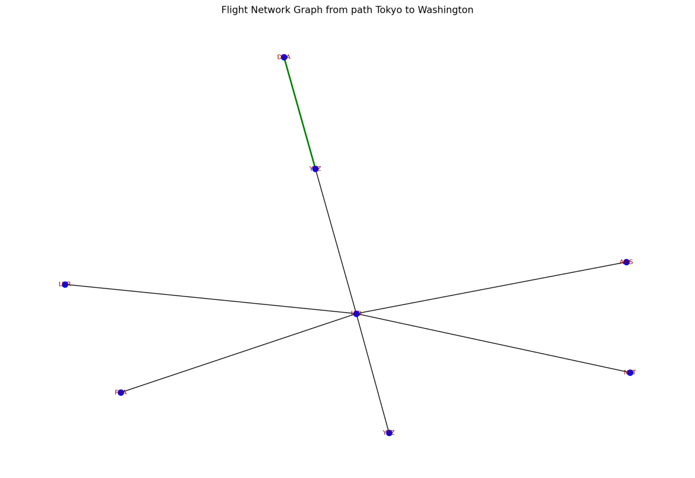
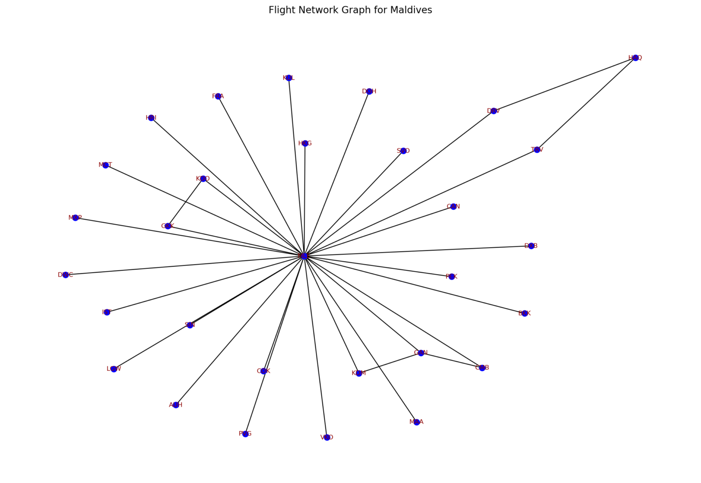

Flight Route Optimization
This project aims to optimize flight routes using machine learning and graph algorithms. It uses Random Forest for predicting travel times and Dijkstra’s algorithm for finding the shortest path.
It predicts travel times between airports, finds the shortest flight route based on input destinations and optimize travel times using machine learning models.
To run the project locally: 
git clone <[repo_url](https://github.com/Atharva-099/Flight-Route-Optimization)>
cd Flight-Route-Optimization
pip install -r requirements.txt
python main.py
python city_routes.py

